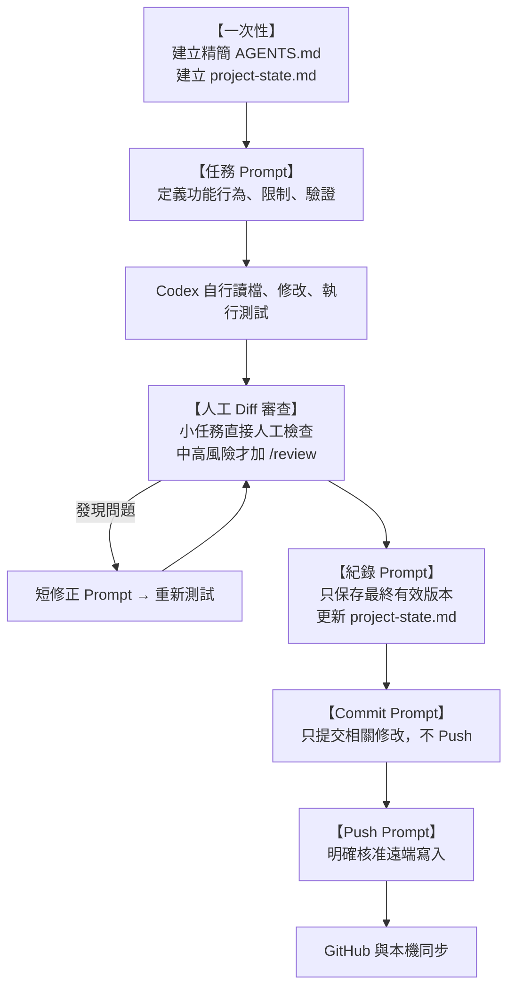

# An ideal workflow 理想上的工作流

1. 設定 AGENTS.md
2. 清楚的功能 Prompt
3. Codex 自行修改並測試
4. 在 Diff 面板人工審查
5. 必要時要求修正或執行 /review
6. 保存「最終有效 Prompt」與專案狀態
7. Commit
8. 人工核准 Push

## 完整版

```mermaid
graph TD
    A["【一次性】<br>建立精簡 AGENTS.md<br>建立 project-state.md"] --> B["【任務 Prompt】<br>定義功能行為、限制、驗證"]
    B --> C["Codex 自行讀檔、修改、執行測試"]
    C --> D["【人工 Diff 審查】<br>小任務直接人工檢查<br>中高風險才加 /review"]
    
    D -->|發現問題| E["短修正 Prompt → 重新測試"]
    E --> D
    
    D --> F["【紀錄 Prompt】<br>只保存最終有效版本<br>更新 project-state.md"]
    F --> G["【Commit Prompt】<br>只提交相關修改，不 Push"]
    G --> H["【Push Prompt】<br>明確核准遠端寫入"]
    H --> I["GitHub 與本機同步"]
```
